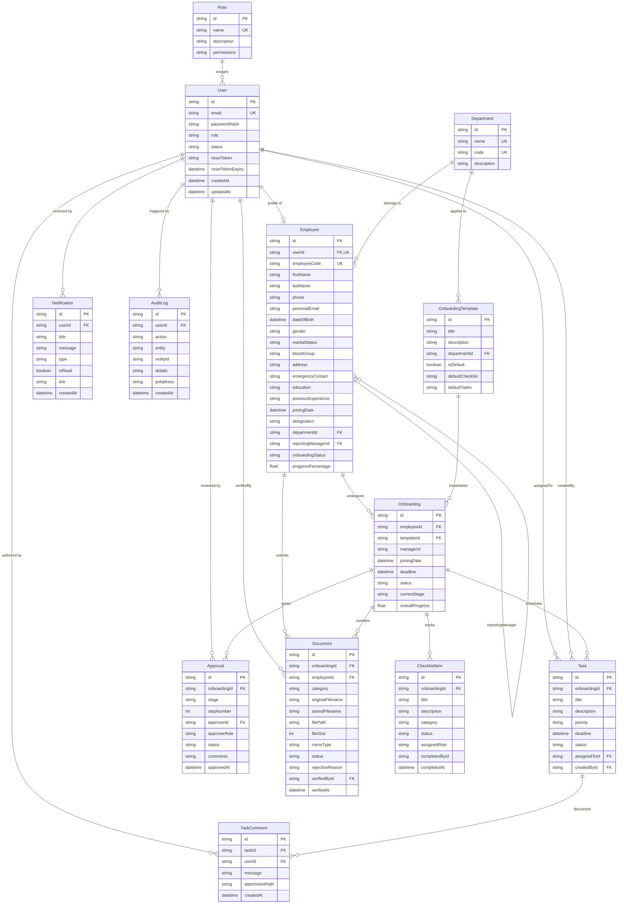

# Database Entity-Relationship (ER) Diagram

The Employee Onboarding Portal utilizes a relational SQLite database managed via Prisma ORM.

```mermaid
erDiagram
    Role ||--o{ User : "assigns"
    User ||--o| Employee : "profile of"
    User ||--o{ Task : "assignedTo"
    User ||--o{ Task : "createdBy"
    User ||--o{ TaskComment : "authored by"
    User ||--o{ Approval : "reviewed by"
    User ||--o{ Notification : "received by"
    User ||--o{ AuditLog : "triggered by"
    User ||--o{ Document : "verifiedBy"

    Department ||--o{ Employee : "belongs to"
    Department ||--o{ OnboardingTemplate : "applies to"

    Employee ||--o{ Employee : "reportingManager"
    Employee ||--o{ Onboarding : "undergoes"
    Employee ||--o{ Document : "submits"

    OnboardingTemplate ||--o{ Onboarding : "instantiates"

    Onboarding ||--o{ Document : "contains"
    Onboarding ||--o{ ChecklistItem : "tracks"
    Onboarding ||--o{ Task : "schedules"
    Onboarding ||--o{ Approval : "gates"

    Task ||--o{ TaskComment : "discussion"

    User {
        string id PK
        string email UK
        string passwordHash
        string role
        string status
        string resetToken
        datetime resetTokenExpiry
        datetime createdAt
        datetime updatedAt
    }

    Role {
        string id PK
        string name UK
        string description
        string permissions
    }

    Department {
        string id PK
        string name UK
        string code UK
        string description
    }

    Employee {
        string id PK
        string userId FK,UK
        string employeeCode UK
        string firstName
        string lastName
        string phone
        string personalEmail
        datetime dateOfBirth
        string gender
        string maritalStatus
        string bloodGroup
        string address
        string emergencyContact
        string education
        string previousExperience
        datetime joiningDate
        string designation
        string departmentId FK
        string reportingManagerId FK
        string onboardingStatus
        float progressPercentage
    }

    OnboardingTemplate {
        string id PK
        string title
        string description
        string departmentId FK
        boolean isDefault
        string defaultChecklist
        string defaultTasks
    }

    Onboarding {
        string id PK
        string employeeId FK
        string templateId FK
        string managerId
        datetime joiningDate
        datetime deadline
        string status
        string currentStage
        float overallProgress
    }

    Document {
        string id PK
        string onboardingId FK
        string employeeId FK
        string category
        string originalFilename
        string storedFilename
        string filePath
        int fileSize
        string mimeType
        string status
        string rejectionReason
        string verifiedById FK
        datetime verifiedAt
    }

    ChecklistItem {
        string id PK
        string onboardingId FK
        string title
        string description
        string category
        string status
        string assignedRole
        string completedById
        datetime completedAt
    }

    Task {
        string id PK
        string onboardingId FK
        string title
        string description
        string priority
        datetime deadline
        string status
        string assignedToId FK
        string createdById FK
    }

    TaskComment {
        string id PK
        string taskId FK
        string userId FK
        string message
        string attachmentPath
        datetime createdAt
    }

    Approval {
        string id PK
        string onboardingId FK
        string stage
        int stepNumber
        string approverId FK
        string approverRole
        string status
        string comments
        datetime approvedAt
    }

    Notification {
        string id PK
        string userId FK
        string title
        string message
        string type
        boolean isRead
        string link
        datetime createdAt
    }

    AuditLog {
        string id PK
        string userId FK
        string action
        string entity
        string entityId
        string details
        string ipAddress
        datetime createdAt
    }
```
